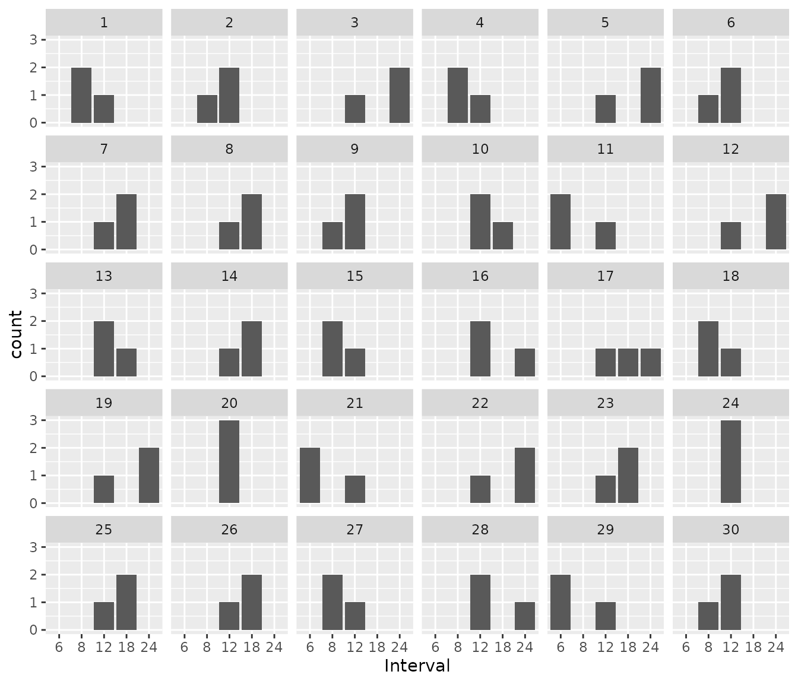

# Dose and interval adaptation (vancomycin)

In this vignette, we will demonstrate the following tools:

- using {mipdtrial} to simulate a trial, with the trial design specified
  using R code.
- comparing two different algorithms for determining the next dose by
  different calls to
  [`create_regimen_update_design()`](../reference/create_regimen_update_design.md)

## Motivation

In model-informed precision dosing we can update doses, but of course we
can also reduce or increase the dosing interval length. This can also be
studied using the `mipdtrial` package.

``` r
library(mipdtrial)
library(dplyr)   # for easier data manipulation 
#> 
#> Attaching package: 'dplyr'
#> The following objects are masked from 'package:stats':
#> 
#>     filter, lag
#> The following objects are masked from 'package:base':
#> 
#>     intersect, setdiff, setequal, union
library(tidyr)
library(ggplot2) # for plotting our results
```

## 1. Define the trial design

This simulated trial will have two samples, with a peak and trough
collected in dose 1 and 3.

``` r
tdm_design <- create_sampling_design(
  offset = c(1, -1, 1, -1), # sample 1-hour before true trough, and at peak+1hr
  when = c("peak", "trough", "peak", "trough"),
  at = c(1, 1, 3, 3),
  anchor = "dose"
)
```

We assume that we can update the dose amount or dosing interval at dose
3 and 5 and aim for an AUC24 of 400-600 mg\*h/L by day 6. We create
different regimen update designs for dose-optimization and interval-
optimization.

``` r
target_design <- create_target_design(
  targettype = "auc24", 
  targetmin = 400,
  targetmax = 600,
  at = 6,
  anchor = "day"
)
dose_update_design <- create_regimen_update_design(
  at = c(3, 5),
  anchor = "dose",
  update_type = "dose",
  dose_optimization_method = map_adjust_dose # fixed interval, optimize dose
)
interval_update_design <- create_regimen_update_design(
  at = c(3, 5),
  anchor = "dose",
  update_type = "interval",
  dose_optimization_method = map_adjust_interval, # allow interval to vary
  grid = c(6, 8, 12, 18, 24, 36, 48) # allowable intervals
)
```

We will be using the Thomson (2009) model for simulation and estimation:

``` r
model_design <- create_model_design(lib = "pkvancothomson")
```

For both trial arms, we will start with a dose estimated to attain the
target exposure metrics based on population PK parameters, assuming a
12-hour interval. For one arm of the trial, this interval will stay
fixed at 12 hours, while for the other arm, we will allow the interval
to vary.

``` r
initial_method <- create_initial_regimen_design(
  method = model_based_starting_dose,
  regimen = list(
    interval = 12,
    type = "infusion",
    t_inf = 1
  ),
  settings = list(
    auc_comp = 3,
    dose_resolution = 250,
    dose_grid = c(250, 5000, 250)
  )
)
      
```

Now we can combine these design choices into two trial arm designs:

``` r
design1 <- create_trial_design(
  sampling_design = tdm_design, 
  target_design = target_design,
  regimen_update_design = dose_update_design, # arm 1
  initial_regimen_design = initial_method,
  sim_design = model_design, est_design = model_design
)

design2 <- create_trial_design(
  sampling_design = tdm_design,
  target_design = target_design,
  regimen_update_design = interval_update_design, # arm 2
  initial_regimen_design = initial_method,
  sim_design = model_design, est_design = model_design
)
```

## 2. Create a set of digital patient covariates

For this example, we will randomly generate a set of weights and
creatinine clearances (CRCLs) for our synthetic data set. See
`sampling_timing()` vignette for a longer description.

``` r
set.seed(15)
dat <- data.frame(
  ID = 1:30,
  weight = rnorm(30, 90, 25),               # kg, normally distributed
  crcl = exp(rnorm(30, log(6), log(1.6)))   # L/hr, log-normally distributed 
)
dat$CL_HEMO <- 0 # required covariate for our model
```

We also need to link the covariates in our data set to the covariates
expected in the model:

- To check which covariates are required for your model use
  [`PKPDsim::get_model_covariates()`](https://insightrx.github.io/PKPDsim/reference/get_model_info.html):

  ``` r
  PKPDsim::get_model_covariates(model_design$model)
  #> [1] "WT"      "CRCL"    "CL_HEMO"
  ```

- To check which covariates are in your data set use
  [`colnames()`](https://rdrr.io/r/base/colnames.html):

  ``` r
  colnames(dat)
  #> [1] "ID"      "weight"  "crcl"    "CL_HEMO"
  ```

``` r
cov_map <- c(
  WT = "weight", 
  CRCL = "crcl",
  CL_HEMO = "CL_HEMO"
)
```

## 4. Simulate a trial!

Patients will get a model-based dose (using population PK parameters),
and then we will adjust either the dose or the interval based on the MAP
Bayesian fit made using the collected samples.

Individual PK parameters will be randomly generated based on the
interindividual variability described in the model, and residual
variability will be added to each sample collected using the error model
described in the model.

``` r
res1 <- run_trial(
  data = dat,
  design = design1,
  cov_mapping = cov_map,
  progress = FALSE,
  seed = 15
)
#> ℹ Starting simulations in 1 threads
#> ℹ Post-processing results
res2 <- run_trial(
  data = dat,
  design = design2,
  cov_mapping = cov_map,
  progress = FALSE,
  seed = 15
)
#> ℹ Starting simulations in 1 threads
#> ℹ Post-processing results
```

## 5. Analyze results

Let’s see how well that worked. In the figure below we plot the steady
state AUC that is attained using the regimen updated at the time shown
on the x-axis. You would expect over time the steady state AUC to
approach the middle of the range more closely, as more TDM is available
to optimize the dose. Since we’re keeping the interval fixed, each
patient will have the same dose update times on the x-axis.

``` r
ggplot(res1$dose_updates) +
  aes(x = t, y = auc_before_update, group = id) +
  geom_rect(
    xmin = -Inf, xmax = Inf, ymin = 400, ymax = 600,
    fill = "#3870FA", alpha = 0.2
  ) +
  geom_line() +
  geom_point() +
  xlab("Time of regimen update (Dose update algorithm)") + 
  ylab("Resulting AUC at t=6 days (mg*h/L)")
```


We can do the same for the intervan update algorithm:

``` r
ggplot(res2$dose_updates) +
  aes(x = t, y = auc_before_update, group = id) +
  geom_rect(
    xmin = -Inf, xmax = Inf, ymin = 400, ymax = 600,
    fill = "#3870FA", alpha = 0.2
  ) +
  geom_line() +
  geom_point() +
  xlab("Time of regimen update (Interval update algorithm)") + 
  ylab("Resulting AUC at t=6 days (mg*h/L)")
```


When we plot the results of this simulation, we now see that dose update
times are flexible, and not the same for each patient. We again see that
the resulting steady state AUC24 also approaches the middle of the
targeted AUC range. So this shows that the dosing interval can also be
used very easily to obtain optimal drug exposure.

We can also look to see which intervals were chosen per patient. Some
patients stayed on an interval of 12 hours throughout the treatment
course, while for other patients, interval changed 1 or more times.

``` r
res2$dose_updates %>%
  ggplot() +
    geom_bar(aes(x = as.factor(interval_before_update))) +
    facet_wrap(~id) +
    xlab("Interval")
```


